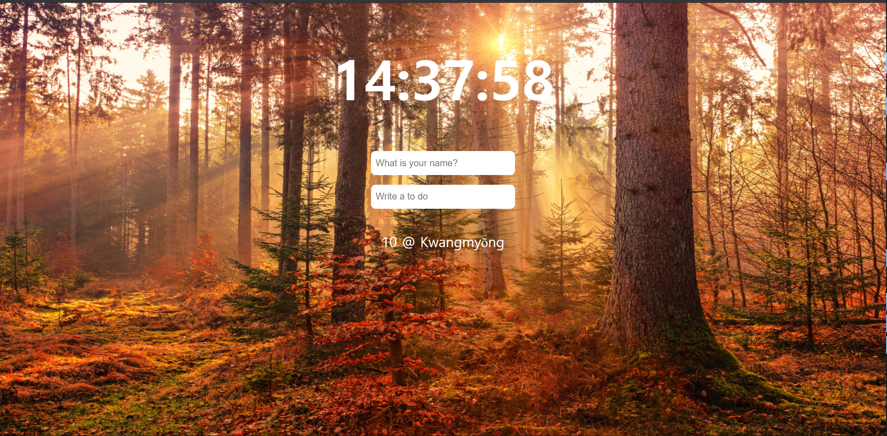
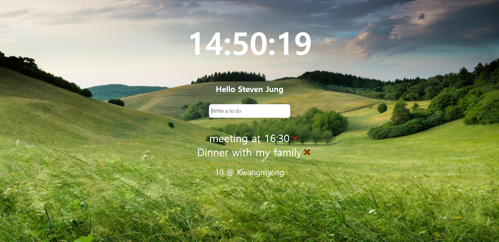

# Momento 

##### Momentum(Chrome Extension) Clone Coding

> **2020.03.02~03.08**

> **Stack**: HTML, CSS, Vanilla JS, (not mobile friendly)
>
> **Tools :** Visual Studio Code, Weather API(Google)
>
> **purpose** : Practice and review my basic skills of HTML, CSS and JS, also get used to JS by using DOM to connect HTML and JS. Moreover, learn how to make dynamic website and also learn the advantages of using pure Java Script

> 03.02 ~ 03.03: Study and review basics of HTML, CSS and Java Script
>
> 03.03~03.04:  JS works done(NO ANY LIBRARIES)
>
> 03.08: CSS works for better design

------

- 웹앱 실행 혹은 새로고침시 여러종류의 배경화면 사진이 랜덤으로 나타난다
- https://openweathermap.org/의 API를 사용하여 사용자의 현재 위치를 가져와 해당 지역의 온도 및 지역명을 추가했다

---

---

---

---

