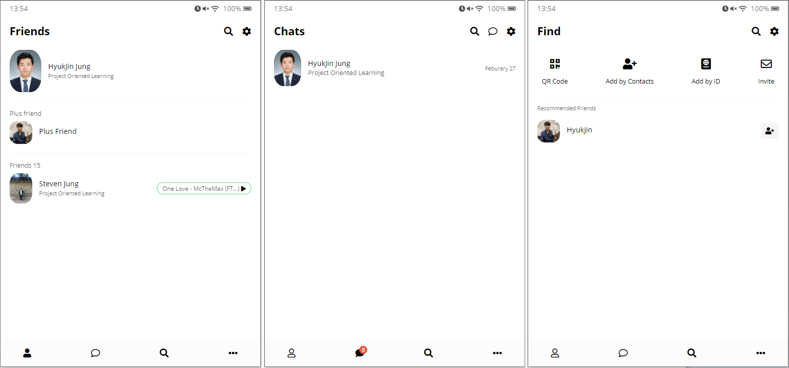
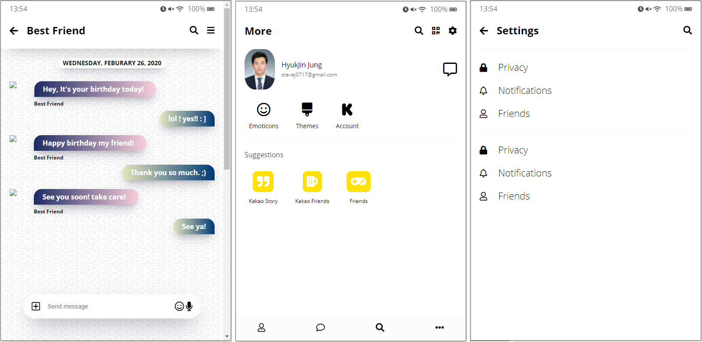

# KakaoTalk Clone Coding

> **2020.02.25 ~ 02.27**

> **Stack**: HTML, CSS, Responsive App
>
> **Tools :** Visual Studio Code

> **purpose** : Study and review basics of HTML and CSS

#### Start Clone Coding!

> **02.25~26 :** Works on HTML done

> **02.27 :** Works on CSS done

---

---

---

---

