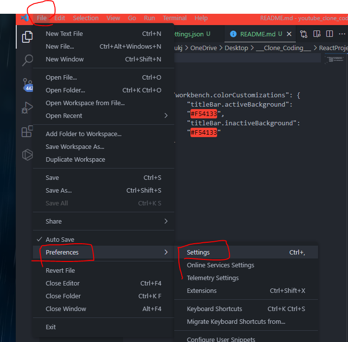
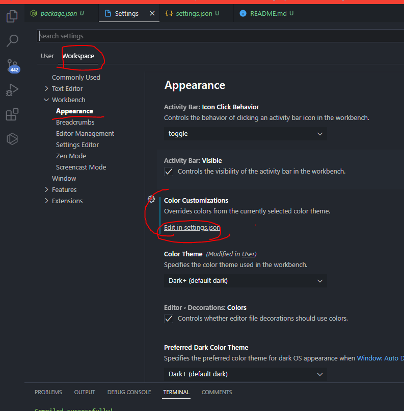

## vsCode 최상단 타이틀바 색상 변경 방법

1. File -> Preferences -> Settings



2. ***User*** : 작업하는 모든 프로젝트에 적용 <br>
   ***Workspace*** : 현재 프로젝트에만 적용



```md
{
    "workbench.colorCustomizations": {
        "titleBar.activeBackground": "#F54133",
        "titleBar.inactiveBackground": "#F54133"
    }
}
```

---

