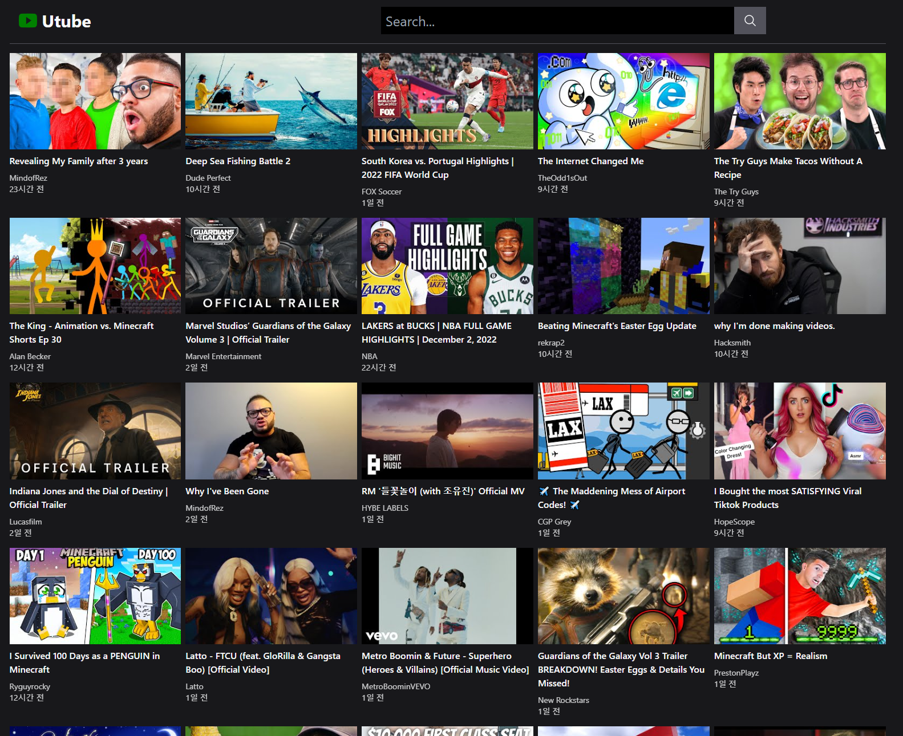
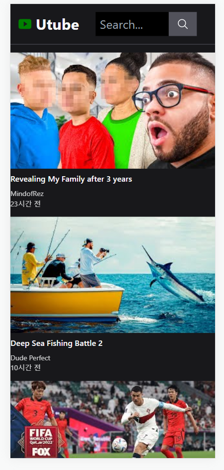
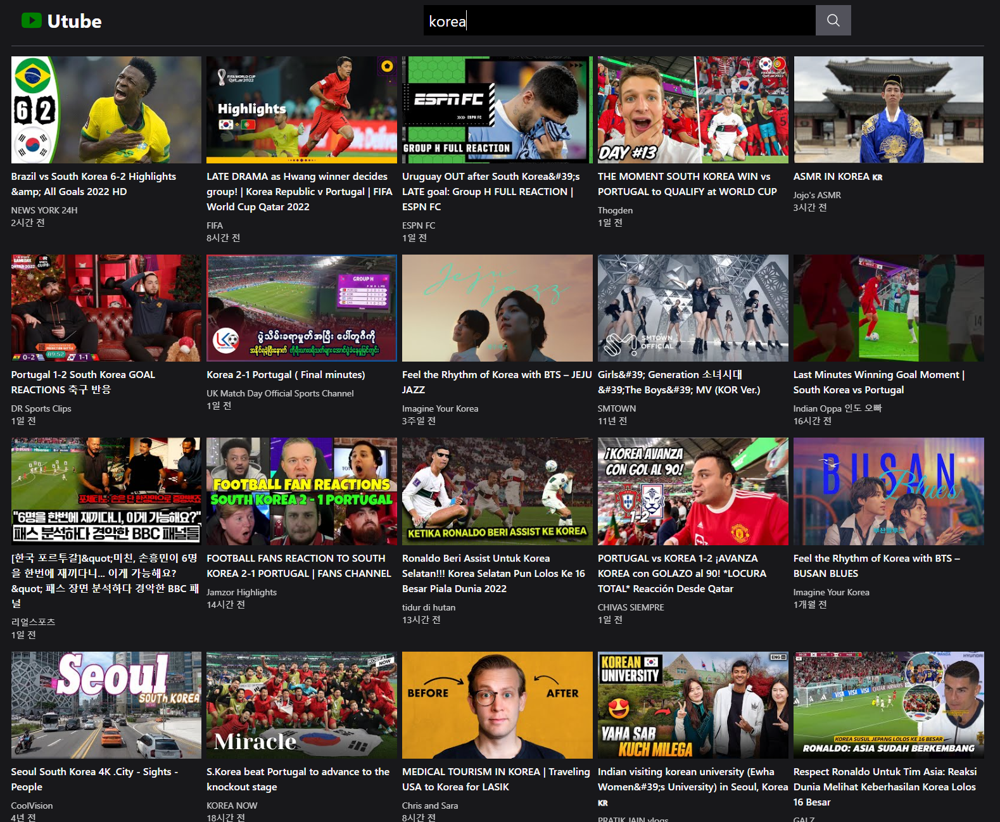
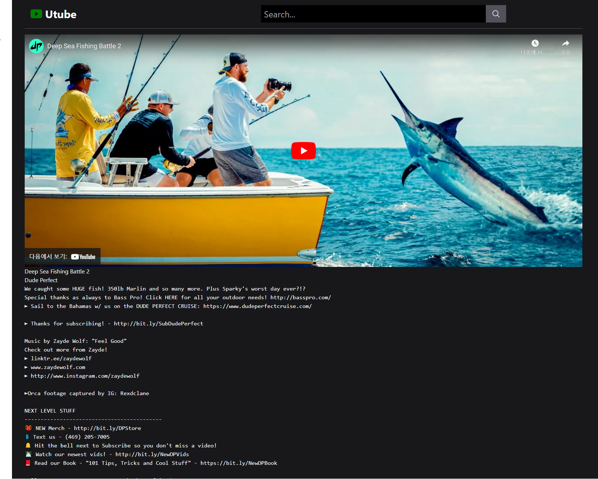

# Utube ( Youtube 클론 코딩 - 연습용 )

### - 사용 언어 : ReactJS
### - 사용 기술 : React Query, React Icons, React Router, Axios, Timeago.js
### - 스타일링 : Tailwind
### - 사용 api : Youtube api
---
<br>

## 구조
```md
- src
    - api
        - youtube.js
    - components
        - ChannelInfo.jsx
        - RelatedVideos.jsx
        - SearchHeader.jsx
        - VideoCard.jsx
    - context
        - YoutubeApiContext.jsx
    - pages
        - NotFound.jsx
        - VideoDetail.jsx
        - Videos.jsx
    - util
        - date.js
    - App.js
    - index.js
```

```js
// index.js
const router = createBrowserRouter([
  {
    path : '/',
    element : <App />,
    errorElement : <NotFound />,
    children : [
      { index : true, element : <Videos />},
      { path : 'videos', element : <Videos />},
      { path : 'videos/:keyword', element : <Videos />},
      { path : 'videos/watch/:videoId', element : <VideoDetail />},
    ],
  }
]);

const root = ReactDOM.createRoot(document.getElementById('root'));
root.render(
  <React.StrictMode>
    <RouterProvider router={router}/>
  </React.StrictMode>
);
```

```js
// App.js
const queryClient = new QueryClient();
function App() {
  return (
    <>
      <SearchHeader />
      <QueryClientProvider client={queryClient}>
        <Outlet />
      </QueryClientProvider>
    </>
  );
}

export default App;
```

---
<br>

## 주요 기능
- ### 메인 화면 - 웹뷰

<br>

- ### 앱뷰


```js
// Videos.jsx
export default function Videos() {
  const { keyword } = useParams();
  const {
    isLoading,
    error,
    data: videos,
  } = useQuery(["videos", keyword], () => search(keyword), );
  
  return (
    <>
      {isLoading && <p>Loading...</p>}
      {error && <p>Something is wrong</p>}
      {videos && (
        <ul className="grid grid-cols-1 sm:grid-cols-2 lg:grid-cols-3 xl:grid-cols-4 2xl:grid-cols-5 gap-2 gap-y-4">
          {videos.map((video) => (
            <VideoCard key={video.id} video={video} />
          ))}
        </ul>
      )}
    </>
  );
}
```

- ### 검색 기능


```js
// SearchHeader.jsx
export default function SearchHeader() {
  const { keyword } = useParams();
  const navigate = useNavigate();
  const [text, setText] = useState("");
  const handleSubmit = (e) => {
    e.preventDefault();
    navigate(`/videos/${text}`);
  };

  useEffect(() => {
    setText(keyword || "");
  }, [keyword]);

  return (
    <header className="w-full flex p-4 text-2xl border-b border-zinc-600 mb-4">
      <Link to="/" className="flex items-center w-5/12 ">
        <IoLogoYoutube className="text-4xl text-brand" />{" "}
        {/* tailwind.config.js에 설정되어있음 */}
        <p className="text-3xl font-bold ml-2 w-full">Utube</p>
      </Link>
      <form onSubmit={handleSubmit} className="w-full flex justify-center">
        <input
          className="w-7/12 p-2 outline-none bg-black text-gray-50"
          type="text"
          placeholder="Search..."
          value={text}
          onChange={(e) => setText(e.target.value)}
        />
        <button className="bg-zinc-600 px-4">
          <IoSearchOutline />
        </button>
      </form>
    </header>
  );
}
```

---
<br>

- ### 클릭 시 상세 정보


```js
// VideoDetail.jsx
export default function VideoDetail() {
  const {
    state: { video },
  } = useLocation();

  const { channelId, channelTitle, title, description } = video.snippet;

  return (
    <section>
      <article>
        <iframe
          id="player"
          type="text/html"
          width="100%"
          height="640"
          src={`http://www.youtube.com/embed/${video.id}`}
          frameBorder="0"
        />
        <div>
          <p>{title}</p>
          <ChannelInfo id={channelId} name={channelTitle} />
          <pre>{description}</pre>
        </div>
      </article>
      <article>
        <RelatedVideos id={video.id} />
      </article>
    </section>
  );
}
```
---
<br>

