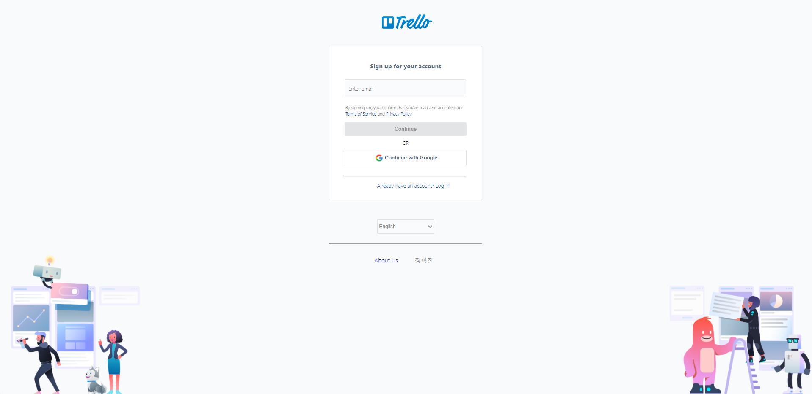
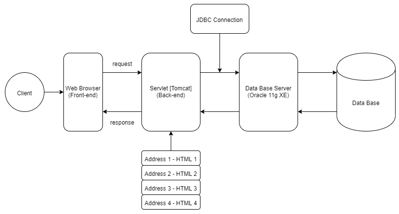
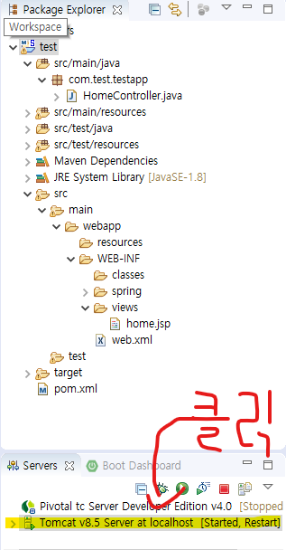

# Trello Clone Coding

> #### **2020.01.10 ~ 2020.03.10**

> **Stack**: 
>
> 1. Front-end: HTML, CSS, Vanilla JS, Responsive web app
> 2. Back-end:  RDBMS(oracle db)  - ora11g_xe
> 3. Server
>    - servlet
>    - spring - **3.9.11 RELEASE**(maven - **3.6.2**)
>    - tomcat(**8.5**)
>
> **Tools :** Visual Studio Code, Spring
>
> **purpose** : Through the Trello code cloning project, study the structure of website and the way of it is working.

> 03.02 ~ 03.03: Study and review basics of HTML, CSS and Java Script
>
> 03.03~03.04:  JS works done(NO ANY LIBRARIES)
>
> 03.08: CSS works for better design
>
> **+++++ Backend는 구현되지 않았습니다 +++++**

-------------

- Main page


---

- Login page


---

- Sign up pages




---

- Mobile friendly (responsive)


---



-----

---

### 진행사항 (Progress note)

### 2020.01.10 환경설정

##### maven 설치중 오류 발생

> - 상황
>   - sts와 eclipse를 설치 완료하고 maven과의 연동을 함
> - 문제
>   - maven 설치를 sts가 아닌 eclipse에 하는데 무한 다운 에러가 생겨서 고민
> - 해결 
>   - sts에서 maven 설정을 하니 maven 오류가 나지 않음 
>   - [해결](https://aristatait.tistory.com/65) 사이트

##### pom.xml에서 default 설정 완료

> - `<java-version>`  1.8로 변경
> - `<org.springframework-version>` 4.3.3.RELEASE로 변경
> - `<plugin>` 중 `<source>`, `<target>`1.8로 변경
> - [설치2](https://all-record.tistory.com/156) 사이트 참고

##### spring과 톰캣 연동 완료

> - [설치1](https://all-record.tistory.com/46) [설치2](https://all-record.tistory.com/156) 순서대로 설치

#####  코드 실행 시 포트 중복 에러 해결 완료

> - 상황
>   - HomeController.java를 tomcat서버를 통해 브라우저에 home.jsp를 올림
> - 문제
>   - 다음과 같은 오류 발생

>
>```word
>starting tomcat v8.5 server at localhost has encountered a problem
>```
>
>- 해결 
>
> - 오류를 좀더 자세하게 보면 8080 , 8009포트를 oracle에서 사용하고 있다고 한다 그래서 수동으로 tomcat 포트 번호를 바꿔주면 해결 가능하다 
>
>  
>
>  - 
>
>  
>
>  
>
>  - servers에서 Tomcat 을 실행해준다
>
>    
>
>  - 다음과 같은 페이지가 나오는데 HTTP/1.1이 8080 , AJP가 8009으로 되있다면 윗 사진과 같이 변경한다.
>
>  - [해결](https://coding-factory.tistory.com/13)  사이트

##### 코드 실행 시 한글 깨짐 현상이 발생

   > - 상황
   >   - 코드 실행
   > - 문제
   >   - 브라우저에서 한글 깨짐
   > - 해결
   >   - home.jsp파일에 다음 코드를 추가
   >
   > ```jsp
   > <%@ page language="java" contentType="text/html; charset=UTF-8" pageEncoding="UTF-8" %>
   > <!-- UTF-8인코딩을 하기 위한 코드 -->
   > <!--상단에 추가해 준다. ->
   > ```

---------------------

### 2020.1.22 

### IOC 사용해서 객체 만들고 사용해보기 

> - 상황
>
>   - main.jsp에서 인스턴스(new) 생성 없이 Calculation 클래스 사용
>
>   ``` java
>   // main
>   package com.test.cal;
>   
>   import org.springframework.context.support.AbstractApplicationContext;
>   import org.springframework.context.support.GenericXmlApplicationContext;
>   
>   public class main {
>   
>   	public static void main(String[] args) {
>   		// TODO Auto-generated method stub
>           //bean에 등록한 객체들을 담고있는 파일 주소 지정
>   		String configLocation = "classpath:spring/application-config.xml";
>   		//이부분은 누가 좀 채워 줘욥
>           //햇깔림 ㅠㅠㅠ
>   		AbstractApplicationContext ctx = 
>   	            new GenericXmlApplicationContext(configLocation);
>   		// ctx.getBean(빈에 등록한 클래스의 id값, 클래스 실제 이름)
>           //new로 인한 의존성 대신 loc에 등록되어있는 Calculation을 사용하기 위한 메서드
>   		Calculation cal = ctx.getBean("cal",Calculation.class);
>   		
>   		//Calculation에 있는 print_() 메서드 호출
>   		cal.print_();
>   	}
>   
>   }
>   
>   ```
>   -  beans에 등록된 calPrint 클래스를 loc를 이용해서 사용 -- 2020.1.21
>
>   ```java
>   package com.test.cal;
>   
>   public class Calculation {
>   	//bean에 등록 시켜 놓음으로서 new 인스터스 생성 필요 없음
>   	CalPrint calPrint;
>   
>   	//필드 변수 a , b정의
>   	int a;
>   	int b;
>   
>   	//---- CalPrint()의 get-set 메서드
>   	public CalPrint getCalPrint() {
>   		return calPrint;
>   	}
>   	// Calculation에서 bean에 등록되어 있는 CalPrint를 사용하기 위해서는 setter 메서드가 필요하다 
>   	public void setCalPrint(CalPrint calPrint) {
>   		this.calPrint = calPrint;
>   	}
>   	//---- CalPrint()의 get-set 메서드	
>       //---- a, b의 get-set메서드 
>   	public int getA() {
>   		return a;
>   	}
>   
>   	public void setA(int a) {
>   		this.a = a;
>   	}
>   
>   	public int getB() {
>   		return b;
>   	}
>   
>   	public void setB(int b) {
>   		this.b = b;
>   	}
>       //---- a, b의 get-set메서드 
>   	public void print_() {
>           //calPrint에 있는 myPrint메서드에 xml에서 value값으로 받은 a,b를 인수로 넘김
>   		calPrint.myPrint(this.a , this.b);
>   	}
>   
>   }
>   ```
>
>   CalPrint 클래스 myPrint()--2020.1.21
>
>   ```java
>  package com.test.cal;
>   
>   public class CalPrint {
>   
>       //Calculation print_() 메서드로 인해 받은 a,b를 +한 후 출력
>   	public void myPrint(int a , int b) {
>   		System.out.println("더한 값은, "+(a+b));
>   	}
> }
>   ```
> 
>   - application-config.xml 사용
>
>   ``` xml
>  <?xml version="1.0" encoding="UTF-8"?>
>   <beans xmlns="http://www.springframework.org/schema/beans"
>   	xmlns:xsi="http://www.w3.org/2001/XMLSchema-instance"
>   	xsi:schemaLocation="http://www.springframework.org/schema/beans http://www.springframework.org/schema/beans/spring-beans.xsd">
>   
>       <-->CalPrint를 bean등록 id 는 CalPrint</-->
>   	<bean id = "CalPrint" class = "com.test.cal.CalPrint">
>   	</bean>
>   	<-->Calculation을 bean등록 id cal</-->
>   	<bean id = "cal" class = "com.test.cal.Calculation">
>           <-->Calculation 클레스에서 calPrint를 사용하기 때문에 property 태그를 이용해서 ref 		   지정</-->
>   		<property name="calPrint">
>   			<ref bean="CalPrint"></ref>
>   		</property>
>           <-->Calculation의 setA의 메서드를 사용하기 위해 name에 set을 지우고 첫 글자가 대문			자라면 소문자로 바꾼뒤 name을 지정한다</-->
>           <-->value는 임의로 지정한다</-->
>   		<property name="a" value = "1"></property>
>   		<property name="b" value = "2"></property>
>   	</bean>
> </beans>
>   ```
> 

### 2020.02.01

> - Front-end : main.html 제작
>   - 플랫폼 가져오기 X, 부트스트랩 X, 완전 제로부터 시작!
>   - 트렐로 메인 화면을 보고 개발자모드를 보지 않은 상태에서, 눈으로 보고 직접 따라 만듬.
>   - 색상, 로고, 웹 배경화면 이미지만 가져와서 사용함.

### 2020.02.02

> - 반응형웹이 아니라 웹 사이즈를 줄일 시, 틀이 무너지고, 글자와 이미지가 겹치거나 깨지는 현상이 발생.
>
> - media query를 사용하여 화면을 줄일 시, 그 크기에 반응하도록 재제작. (여전히 부트스트랩 사용 X)

### 2020.02.07

> - Front-end : login.html 제작
>   - 코드 작성 시 각 태그에 style을 넣어서 진행을 함
>     - 가독성이 떨어지고 유지 보수가 힘들어 head태그안에 style태그를 만들어 코드이동.

### 2020.02.09

> - css폴더와 각 html의 css파일을 만들어 style 태그안에 디자인 속성 코드를 전부 이동함.
>   - 유지보수가 더욱 편해짐

### 2020.02.14

> - Front-end : signUp.html 제작
>   - 로그인 폼, 회원가입 폼을 처음에 div로 구성하여 문제가 됨.
>     - form태그로 다시 감싸주는 작업 진행. (엄청 기본적인 건데...)
>     - focus()를 사용하여 웹브라우저를 켰을 때 자동으로 커서가 입력창에 대기하도록 설정.

### 2020.02.20

> # JDBC 연동 및 사용 완료
>
> ## pom.xml
>
> **Spring** 에서 **jdbc**를 사용하기 위해서는 **pom.xml**에 **jbdc** 라이브러리와 사용할 **db** 라이브러리를 선언해줘야 한다
>
> ```xml
> 		<dependency>
> 			<groupId>org.springframework</groupId>
> 			<artifactId>spring-jdbc</artifactId>
> 			<version>${org.springframework-version}</version>
> 		</dependency>
> ```
>
> - 위와 같이 jdbc 라이브러리를 dependency해준다.
> - `<version>` 에 기입되어 있는 것을 placeholder 라고 한다
>
> >### placeholder
> >
> >- **placeholder**란 사용하고 싶은 정보를 미리 선언해주고 그 정보를 **${contents} <- contents** 부분에 기입하면 사용가능 하다.
> >- **변수** 사용하듯 사용하면 된다.
> >
> >#### 장점
> >
> >- 장점으로는 **변수처럼 사용할 수 있어서** 수정할 곳이 여러곳이라면 변수 하나만 수정해주면 한번에 바뀌기 때문에 **수정에 용이** 하다.
>
> jdbc 라이브러리를 선언했으면 사용 db 라이브러리를 선언해야한다 필자는 oracle db를 사용했다.
>
> ```xml
> 		<dependency>
> 			<groupId>com.oracle</groupId>
> 			<artifactId>ojdbc7</artifactId>
> 			<version>12.1.0.2</version>
> 		</dependency>
> ```
>
> - 위 코드를 그대로 작성한다면 **에러가** 날 것이다. 에러가 난다면 ORACLE JDBC Repository를 등록해주지 못해서 이다. 다음 코드를 작성하자.
>
> ```xml
> 	<repositories>
> 		<repository>
> 			<id>oracle</id>
> 			<name>ORACLE JDBC Repository</name>
> 			<url>http://maven.jahia.org/maven2</url>
> 		</repository>
> 	</repositories>
> ```
>
> - 다음과 같이 repository를 등록해주면 **oracle db** 와 **jdbc**을 사용할 수 있다.
>
> ## application-config
>
> 라이브러리에 선언한 **jdbc**를 사용하기 위해선 **bean**등록을 해줘야 한다 왜냐하면 IOC컨테이너에서 의존성 주입(**DI**)을 하기 위해서는 bean에서 생성이 되어야 하기 때문이다.
>
> ```xml
> <context:property-placeholder location="classpath:database/jdbc.properties"/>	
> 
> <bean id="dataSource" class="org.apache.commons.dbcp.BasicDataSource">
> 		<property name="driverClassName" value="${jdbc.driverClassName}"/>	
> 		<property name="url" value="${jdbc.url}"/>
> 		<property name="username" value="${jdbc.username}"/>
> 		<property name="password" value="${jdbc.password}"/>
> </bean>
> ```
>
> - **dataSource**는 db와의 연결을 위한 **connetion** 정보를 담고 있기 때문에 bean등록을 해준다.
> - **property**에 들어갈 value는 placeholder 태그를 통해 location에 등록한 jdbc.properties에 작성해 놓은 정보들을 가져다 사용한다.
>
> dataSource를 등록했으면 Business Logic에서 사용할 jdbcTemplate를 bean등록 해준다.
>
> ```xml
> 	<bean id="jdbcTemplate" class="org.springframework.jdbc.core.JdbcTemplate">
> 		<property name="dataSource" ref="dataSource"></property>
> 	</bean>
> ```
>
> - bean에 등록한 dataSource객체의 setDataSource를 통해 주입을 해준다.
> - 특정객체의 **setter함수**를 **property**를 이용해 사용하기 위해서는  **set을 없에고** 첫번째 함수명을 **소문자**로 바꾸고 ref에 작성해준다.
>
> ## web.xml
>
> 지금까지 설정한 **application-config.xml**을 **client**가 url요청시 사용해야 함으로 **ContextConfigLocation**으로 로드를 시켜줘야 한다. 왜냐하면 **DispatherServlet**으로 요청 url에 대한 servlet**분류를** 하기 전에  **Business** **Logic**을 정의한 스프링 설정 파일을 로드하기 때문!
>
> ```xml
> <context-param>
> 	<param-name>contextConfigLocation</param-name>
> 	<param-value>classpath:spring/application-config.xml</param-value>
> </context-param>
> ```
>
> - **Spring Container** 에 정의되어 있는 **Business login**을 사용하기 위해서는 **application-config.xml**를 로드 시켜준다.
>
> ## Business Login
>
> ### .controller
>
> **dispatcherservlet**에서 요청을 받으면 분류를 통해 해당 **servlet.service()**를 실행해 주는 곳이다. 
>
> client가 로그인을 했을때 로그인 아이디가 db에 있다면 result 페이지를 , db에 없다면 resultFalse 페이지를 응답해주는 로직이다.
>
> 기본적으로 로그인을 했을때 db에 해당 유저가 없으면 회원가입을 해야하기 때문에 꼭 필요하 작업이라고 생각했다.
>
> ```java
> @Controller
> public class TrelloController {
> 	@Autowired
> 	LoginService loginService;
> 
> 	@RequestMapping(value = "/login", method = RequestMethod.GET)
> 	public String result(@RequestParam(value = "ID", required = false) String uname, Model model) {
> 		//System.out.println("서버");
> 		//System.out.println(loginService.SearchInfo(uname) + "서버");
> 		if(loginService.SearchInfo(uname) == true) {
> 			return "result";
> 		}
> 		else {
> 			return "resultFalse";
> 		}
> 	}	
> }
> ```
>
> - @RequestMapping으로 요청 url이 /login 이라면 result 함수를 실행 시킨다.
> - 일단 우리는 client에서 작성한 id와 password 데이터를 가져와야 하기 때문에 jsp에서 `<form>` 태그를 사용해서 `<input>`태그의  name값을 넘겨준다. 해당 유저의 data유무를 알기 위해서는 중복값이 없는 ID를 사용하면 되므로  `@RequestParam()`를 통해 id값 하나만 받아 온다.
> - `@RequestParam() `에 들어갈 인자로는 `value` , `required`가 있고 `@RequestParam() ` 바로 뒤에 변수 명을 선언해준다. `requred`를 **false**로 선언해주면 해당 value값이 없다면 BadRequest라는 http 4** 에러가 나는데 그것을 발생하지 않게 한다.
> - 의존성 주입으로 선언한 **loginService**의 SearchInfo 메서드를 실행 시키고 return값으로 true를 받는다면 result.jsp , 아니면 resultFalse.jsp를 web.xml을 통해 client에 응답한다.
>
> ### .Service
>
> Service는 Repository에 정의되어있는 메서드를 실행시킨다 Repository는 주로 db와의 작업을 하기위한 Component이다.
>
> ```java
> @Service
> public class LoginService implements LoginServiceInterface {
> 	
> 	@Autowired
> 	LoginRepository loginRepository;
> 	
> 	@Override
> 	public boolean SearchInfo(String uname) {
> 		boolean result = loginRepository.SearchInfo(uname);
> 		return result;
> 	}
> }
> 
> ```
>
> - db와의 데이터 처리를 위한 **Repository**를 DI하고 해당 클래스의 함수인 SerchInfo를 실행시킨다. return type은 **boolean**이다.
>
> ### .Repository
>
> 앞서 언급한 것과 같이 Repository는 db와의 데이터를 주고 받는 역할을 한다 (쉽게 말해서 ㅎㅎ)
>
> jdbc 객체를 사용하는 곳이기도 하다.
>
> ```java
> @Repository
> public class LoginRepository implements LoginRepositoryInterface{
> 
> 	@Autowired
> 	JdbcTemplate jdbc;
> 	private class loginMapper implements RowMapper<LoginVO>{
> 	      @Override
> 	      public LoginVO mapRow(ResultSet rs, int count) throws SQLException {
> 	    	  LoginVO loginVO = new LoginVO();
> 	    	  
> 	    	  loginVO.setU_id(rs.getInt("user_uid"));
> 	    	  loginVO.setId(rs.getString("uname"));
> 	    	  loginVO.setPassword(rs.getString("pw"));	    	  
> 	         return loginVO;
> 	      }		
> 	}
> 	@Override
> 	public boolean SearchInfo(String uname) {
> 		String sql = "select * from loginTable where uname = ?";
> 		System.out.println("=====");
> 		LoginVO db_LoginVO = jdbc.queryForObject(sql, new loginMapper() , uname);
> 		String input_uname = uname;
> 		String db_uname = db_LoginVO.getId();
> 		System.out.println("db");
> 		System.out.println(db_LoginVO.getId());
> 		System.out.println(uname);		
> 		
> 		if(db_uname.equals(input_uname)) {
> 			System.out.println("성공");
> 			return true;			
> 		}
> 		return false;
> 	}
> }
> ```
>
> - **jdbc**에서 제공해주는 **RowMapper**를 사용하여 원하는 **VO객체에 db에서 가져온 데이터**를 **set**해주는 기능이다. 해당 클래스의 핵심 메서드인 **mapRow**는 매게변수로 **ResultSet**을 가지는데 이는 sql 쿼리 문으로 **Select**로 시작하는 쿼리문을 **db**에 넘기면 해당 **table**의 **데이터가** **ResultSet**에 저장이 된다.
> - 저장된 rs를 이용해 loginVO에 user 정보를 저장시킨다.
> - 다음 메서드로 **SerchInfo()**는 파라미터로 넘어온 **uname** 이 db에 있으면 ture , 없으면 false를 반환하는 메서드이다.
> - sql문은 jdbc.queryForObject를 통해 db에 보내지고 쿼리문 수행후 해당 데이터를 가져와 db_LoginVO에 저장이 된다. 그때 타입은 LoginVO이다. **만약 해당 데이터가 없다면 EmptyResultDataAccessException에러가 생기게 되는데 queryForObject은 데이터가 없으면 0을 리턴하고 에러페이지를 띄운다. (이해한다고 고생..)**
> - `if(db_uname.equals(input_uname))` 에서 equals를 사용한 문자열 비교를 했다. 그이유는 밑과 같다
>
> >### java 문자열 비교
> >
> >- str1 == str2
> >   - 위와 같은 방식은 str의 주소값을 비교하는 것이다
> >   - 따라서 위 코드에 `input_uname` 와 `db_uname` 를 비교한다면 바라보고 있는 주소값이 다르기 때문에 false를 반환한다 (이것도 고생...)
> >- srt1.equals(srt2)
> >   - 위와 같은 방식은 str 값 자체를 비교하는 것이다.
> >   - 주소값을 바라보고 있지 않기 때문에 문자열이 같다면 ture를 반환 한다.
>
> 
>
> 
>
> 
>
> 
>
> >
> >
> >>
> >>
> >>>
> >>>
> >>>발생한 오류 
> >>>
> >>>**ORA-01756: quoted string not properly terminated** 쿼리문에 '를 빼먹음
> >>>
> >>>**EmptyResultDataAccessException** 반환 데이터가 없다면 0을 출력